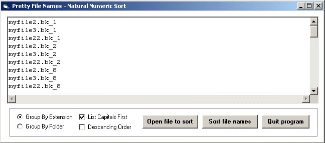



## Pretty File Names v2\.2 \- Final 2\-16\-08

### Description

Hi again all. This module will sort string array items of file paths which may contain numeric characters in a more natural order. I created this in response to a comment made on a previous submission. It is complete with demo and sample files so you can easily load and sort to see the results of the different settings available.

----

It is intended for sorting file names, and will apply the same intuitive order for folders in the file path if they contain numeric characters. It will take into account all occurences of numbers in the string item including in the extension.

----

Specifying a path is not required, neither do they need to have extensions, in fact, they do not need to be file names at all; just strings that may contain numeric characters within the string text. In other words, it can be used for normal pretty-sorting operations as well. But please note, this is intended for sorting file names and is a little slower than the included Pretty Number Sorter because of extra code to handle the extensions.

----

It can order the items by extension, whilst still producing an intuitive order of the file path and names that may have numbers within them and that have the same extension. Or you can group by folder but still include extensions in the comparisons without grouping by them.

----

Also included is a compare function that can be used in place of VB's StrComp that will order the filename items it compares based on the settings described above. It does not sort an array of items but compares just two items and returns the result.

----

This is version 2 (2-5-08) in response to a request to add the handling of numbers in the extension. Bug Fix update 2-6-08.

----

Version 2.1 (2-7-08) adds Indexed versions of my Pretty Sorters. Included in this module: strPrettyFileNames, strPrettyFileNamesIndexed, StrCompFileNames, strPrettyNumSort, strPrettyNumSortIndexed, StrCompNumbers, strPrettySort, strPrettySortIndexed, ValidateIdxArray, strStableSort2Indexed, strSwapSort4Indexed, InitedArray

----

Update (2-8-08) removed the 260 character limit on the three file name routines.

----

Update (2-15-08) with latest and final version of Stable QuickSort v2.2.

----

Update (2-16-08) I just had to fix a design weakness. Removed the requirement to initialize the index array before passing to the indexed sorters. Final number 2!

----

 
### More Info
 

             |
---                |---
**Submitted On**   |2008-02-15 19:44:42
**By**             |[Rde](https://github.com/Planet-Source-Code/PSCIndex/blob/master/ByAuthor/rde.md)
**Level**          |Intermediate
**User Rating**    |5.0 (60 globes from 12 users)
**Compatibility**  |VB 4\.0 \(32\-bit\), VB 5\.0, VB 6\.0
**Category**       |[String Manipulation](https://github.com/Planet-Source-Code/PSCIndex/blob/master/ByCategory/string-manipulation__1-5.md)
**World**          |[Visual Basic](https://github.com/Planet-Source-Code/PSCIndex/blob/master/ByWorld/visual-basic.md)
**Archive File**   |[Pretty\_Fil2102002162008\.zip](https://github.com/Planet-Source-Code/rde-pretty-file-names-v2-2-final-2-16-08__1-63893/archive/master.zip)

